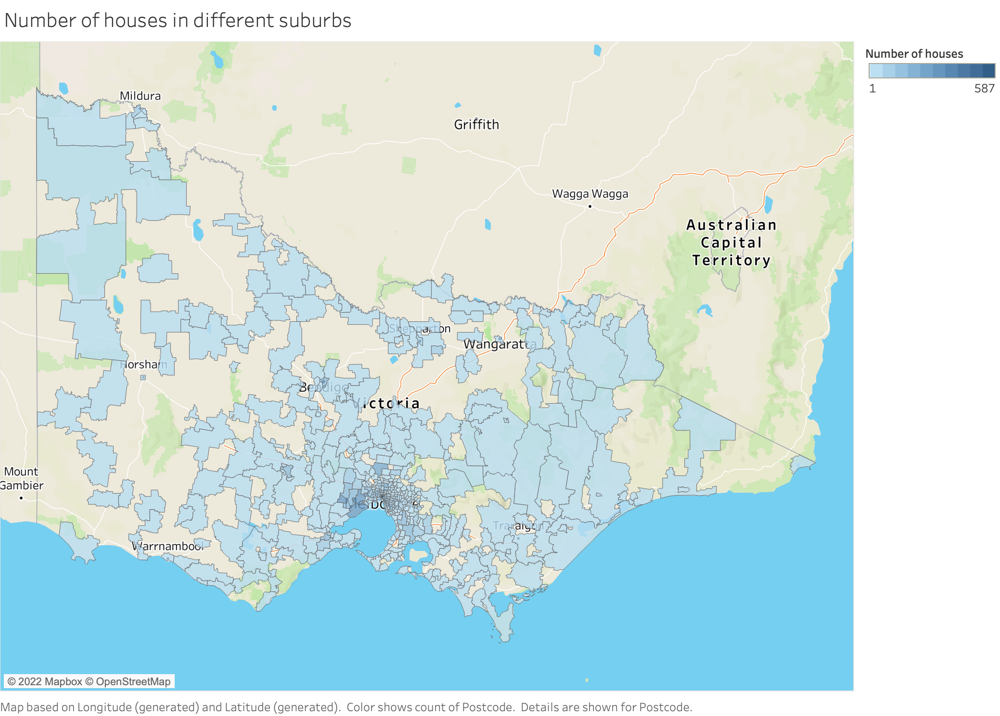
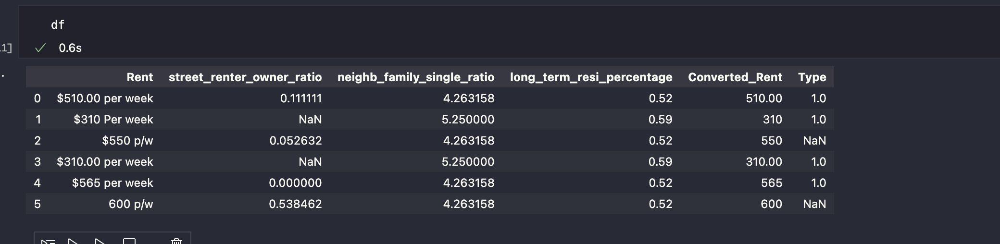

# Group 7 - Sprint 2 (Week 7) Meeting Minutes

**Since we have a sprint 1 meeting during saturday and sunday which cannot post into earily weekly meeting notes (weekly meeting notes due on friday), we will post 2 sprint 1 meetings in sprint 2 meeting notes**

## Table of Content
- [Group 7 - Sprint 2 (Week 7) Meeting Minutes](#group-7---sprint-2-week-7-meeting-minutes)
	- [Table of Content](#table-of-content)
	- [Meeting Time: 10:00am - 11:30am, 3/9/2022, Saturday](#meeting-time-1000am---1130am-392022-saturday)
		- [Agenda:](#agenda)
	- [Meeting Time: 20:00pm - 21:00pm, 4/9/2022, Sunday](#meeting-time-2000pm---2100pm-492022-sunday)
		- [Agenda:](#agenda-1)
	- [Meeting Time: 4:15pm - 6:15pm, 5/9/2022, Monday](#meeting-time-415pm---615pm-592022-monday)
		- [Agenda:](#agenda-2)
	- [Meeting Time: 5:30pm - 6:10pm, 7/9/2022, Wednesday](#meeting-time-530pm---610pm-792022-wednesday)
		- [Agenda:](#agenda-3)
	- [Meeting Time: 8:00pm - 9:30pm, 8/9/2022, Thursday](#meeting-time-800pm---930pm-892022-thursday)
		- [Agenda:](#agenda-4)
   
## Meeting Time: 10:00am - 11:30am, 3/9/2022, Saturday
**Members Attend:**

- [x] QUZIHAN WU
- [x] XINGYAO WANG
- [x] YINAN LI
- [x] ZIXUAN GUO
- [x] ZONGCHAO XIE

### Agenda:
1. Part 1: Discuss internal data (LI and WU)
	- already solve the school scraping problem by finding web script
	- we will cover all school information in our later scraping
    - finally find out 2 ways web-scrapeing to scrape domain data, we will choose one as our main scraping method.
    - approxiamtely have a part of scrape data before tmrs meeeting
  2. Part 2: Discuss external data (WAN, GUO and XIE)
	   - still complete to finding external dataset

## Meeting Time: 20:00pm - 21:00pm, 4/9/2022, Sunday
**Members Attend:**

- [x] QUZIHAN WU
- [x] XINGYAO WANG
- [x] YINAN LI
- [x] ZIXUAN GUO
- [x] ZONGCHAO XIE

### Agenda:
**This meeting including 4 parts, summarise internal dataset \ summarise external dataset \ summarise questions \ sprint 2 todolist**

1. Summarise internal dataset (WU and LI)
	- Our plan is using scrape-script to scrape all data. as results, we finding almost 15000 url links and we generate a parquet file (df) as follows:
    
	- And we also use geopandas to map the postcode attributes, we found we almost cover all VIC surburbs which we think the data is reasonable.
    
	- But we face a problem is price attributes, some script did not contain price dataset, the method that we use is 
		- `property_price  =  bs_object.find("div", {"data-testid": "listing-details__summary-title"})`
		- update: sample run the code with link=6 is working, but the for loop takes extremely long time to scrape
	
	
		- **we still trying to fix this problem**

2. Summarise External dataset (WANG, XIE and GUO)
	- We explore this part in 3 parts
		- Postcode
			- Bus stop
			- Tram station
			- Train station
			- school location
			- High school ranking
			- Shapefile
		- SA2
			- SA2 District Boundaries
			- Total population by SA2 Districts
			- Income by SA2 Districts
		- API
			- Hospital
			- Health
			- Bar
			- Park
			- Police station
			- Shopping
			- Transportation

3. summarise questions (all group members)
	- Whether SA2 DATASET must be used？
	- For the question what are the top 10 suburbs with the highest predicted growth rate, what does this suburb refer to? Each postcode district or SA2 district?
	- How to solve the limit of only 60 data catchable for google API on google map?
	- Can we use tableau for visualization on Map in different dimension?
	-  What is the meaning of this part?
		- 'useful external datasets have been listed above and we expect students to find a way to use Statistical Areas Level 2 (SA2) to derive population forecast and affluence'
	- Is there any population growth datafile provided?

4. Sprint 2 todo
	- FIXING price dataset
	- Download all domain data
	- Organize all domain scrape data with better coding stuff
	- Finish scraping all the required data and saving it for all rental properties.
	- Determine how many properties and features will be sufficient for their project.
	- 
	- Find population growth datafile
	- For school data, think it more deeply
	- All external data done with coding stuff
	- Find a way to use Statistical Areas Level 2 (SA2) to derive population forecast and affluence. 
	- 
	- Find any additional external dataset that may assist in the analysis to answer the 3 big questions.
	- 
	- Learn Open Route Service API accoriding to sprint 3 tasks.
	- 
	- Summarise what we did in sprint1/2 in a notebook

## Meeting Time: 4:15pm - 6:15pm, 5/9/2022, Monday
**Members Attend:**

- [x] QUZIHAN WU
- [x] XINGYAO WANG
- [x] YINAN LI
- [x] ZIXUAN GUO
- [x] ZONGCHAO XIE

### Agenda:

**This meeting session mainly focus on collect answers from last meeting and list sprint 2 todo list**

1. Scrape domain Dataset
   - [x] Finish scrape domain dataset coding
   - [x] Organize all coding stuff (coding correction, results, comments)
   - [x] Create a notebook with visualization
   - [x] Finish scrape domain readme file with visualization
   - [x] Rewrite pull request and merge scrape domain to *main* branch
   - [x] Let group members know and create new branch for preprocessing domain dataset
   - [x] Think about how many properties and features will be sufficient for their project
   - [ ] Preprocessing

2. External Dataset
	- [ ] Intoduce what we already collected
	- [ ] Organize coding stuff
	- [ ] Think about download.py or seperately
	- [ ] Organize all coding stuff (coding correction, results, comments)
    - [ ] Finish external dataset readme file with visualization
    - [ ] Rewrite pull request and merge  external data to *main* branch
    - [ ] Let group members know and create new branch for preprocessing external dataset
    - [ ] Preprocessing
    - [ ] ... ... ...

3. Find a way of to use SA2 to derive population forecast and affluence
	- [ ] Find population growth datafile

4. Learn **Open Route Service API**
	- [ ] OpenRouteService Documentation: Open Route Service API Docs
	- [ ] OpenRouteService Basic Examples: Open Route Services Example Notebooks
	- [ ] OpenRouteService Sample Project: Open Route Services Sample Project
	- [ ] OpenRouteService Sample Project 2 (using sjoin and geopandas): Sample Project

5. Continue learning
	- Regex
	- Pyspark
	- Clustering
	- ML and DL
	- Search and read some report related to house pirce prediction
       - https://www.researchgate.net/publication/5142421_Determinants_of_Market_Rent
       - https://www.researchgate.net/publication/5142346_Determining_Apartment_Rent_The_Value_of_Amenities_Services_and_External_Factors

6. Meeting Minutes and Summarization(md file)

## Meeting Time: 5:30pm - 6:10pm, 7/9/2022, Wednesday
**Members Attend:**

- [x] QUZIHAN WU
- [x] XINGYAO WANG
- [x] YINAN LI
- [x] ZIXUAN GUO
- [x] ZONGCHAO XIE

### Agenda:

1. Organize all external dataset stuff
	- **problem:** google map API only can access 60 rows of data which means not fit our main domain data
	- All group memebers still foucs on find external dataset

## Meeting Time: 8:00pm - 9:30pm, 8/9/2022, Thursday
**Members Attend:**

- [x] QUZIHAN WU
- [x] XINGYAO WANG
- [x] YINAN LI
- [x] ZIXUAN GUO
- [x] ZONGCHAO XIE

### Agenda:

**Still doing external dataset**

1. SA2
	- Income
	- Growth rate

2. Postcode
	- Property
	- PTV Station
	- Hospital
	- Emergency Service: 
    	- police station
      	- amubulance
	- Public Service: 
    	- swimming pool
    	- libary
    	- museum
    	- art gallery
	- Care Facility
    	- child
    	- disability
    	- aged
	- School with ranking