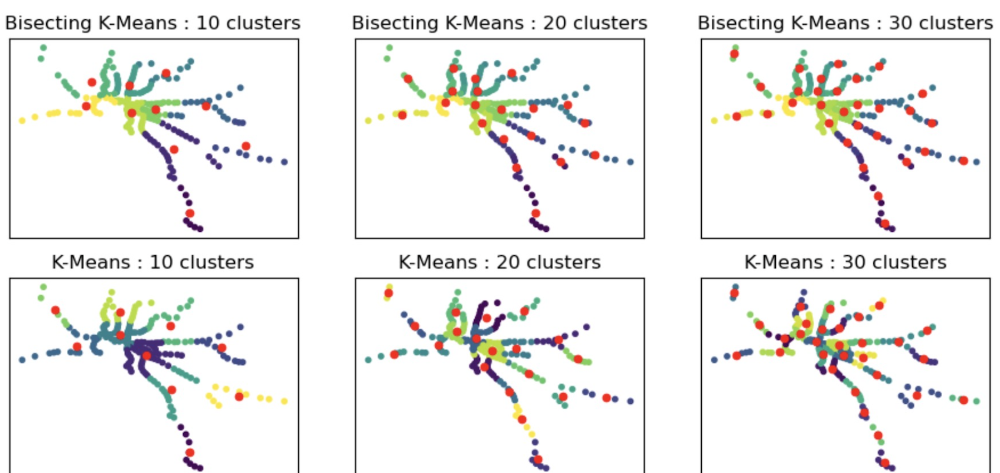

# Group 7 - Sprint 3 (Week 8) Meeting Minutes

## Table of Content
- [Group 7 - Sprint 3 (Week 8) Meeting Minutes](#group-7---sprint-3-week-8-meeting-minutes)
  - [Table of Content](#table-of-content)
  - [Meeting Time: 4:15pm - 6:15pm, 12/9/2022, Monday](#meeting-time-415pm---615pm-1292022-monday)
    - [Agenda:](#agenda)
  - [Meeting Time: 3:30pm - 5:00pm, 13/9/2022, Wednesday](#meeting-time-330pm---500pm-1392022-wednesday)
    - [Agenda:](#agenda-1)
   
## Meeting Time: 4:15pm - 6:15pm, 12/9/2022, Monday
**Members Attend:**

- [x] QUZIHAN WU
- [x] XINGYAO WANG
- [x] YINAN LI
- [x] ZIXUAN GUO
- [x] ZONGCHAO XIE

### Agenda:
1. Domain Dataset
   - Already update to `main`.
2. External Dataset
   - For all external data, we finished basic pre-processing.
   - All external data can be downloaded via URL. 
   - The dataset contains only Victoria data, and some transformations have been made to make the dataset easy to visualize and join with rental property data.
   - We use Statistical Areas Level 2 (SA2) to derive population forecast. 
   - At present, the features of the external data we have selected are all the external dataset that we list in sprint 2 meeting.
3. Sprint 3 todo
- [ ] Find the proximity to the closest train station, this can be done by leveraging an API such as Open Route Service.(all group memebers)
- [ ] If train station is already finished, we can do other external dataset later.(all group memebers)
- [ ] Summarize all external raw data done with pull request. (WU and LI)
- [ ] Start listing out the features that make a property more expensive or sought after.

## Meeting Time: 3:30pm - 5:00pm, 13/9/2022, Wednesday
**Members Attend:**

- [x] QUZIHAN WU
- [x] XINGYAO WANG
- [x] YINAN LI
- [x] ZIXUAN GUO
- [x] ZONGCHAO XIE

### Agenda:
1. Domain Dataset (LI)
   - [ ] **PREPROCESSING**

2. External dataset (all group members)
   - Still processing all download coding stuff together and PR to main
   - will done before **Saturday**
   - Checking todo:
     	- [ ] Organize coding stuff
     	- [ ] Think about download.py or seperately
     	- [ ] Organize all coding stuff (coding correction, results, comments)
      - [ ] Finish external dataset readme file with visualization
      - [ ] Rewrite pull request and merge  external data to *main* branch
      - [ ] Let group members know and create new branch for preprocessing external dataset
      - [ ] Preprocessing

3. Distance problem related ORS
   - We start finding the proximity to the closest train station first, and we summarize 3 ways to doing this by practice
     - IDEA 1: (all group members)
       - Using raw domain dataset and train station data, by using ors to have a long for loop to find which is the closest train station for each property
       - **PROBLEM**: the ors API did not work with high dimension dataset based on 15000 property we have. We always has a runtime error.
     - IDEA 2: (WANG)
       - Use the sklearn to training data
       - Then fit to find the centroid of the Train Station, as shown in below
       - Then use finding distance to calculate the shortest straight-line distance from our property to the nearest centroid we calculated
       - The reason for using kmean is to reduce the complexity, because we feel that it is not slow to calculate in Melbourne, but it may be very slow to calculate the whole Victoria
       - Get the corresponding nearest centroid coordinates, and put them into the API to calculate the driving distance/time

     - IDEA 3: (all group members)
       - Directly use the latitude and longitude to determine the nearest train station in a straight line for each property, the idea is
         - `hs.haversine(domain_coords, (x.latitude, x.longitude))`
       - Use the API to calculate the driving distance
       - Since it may be difficult for some properties to reach the nearest train station in a straight line, such as across the lake or river, etc., we are also considering finding the nearest 2-3 train stations for each property in a straight line distance
       - use the API to calculate the driving distance of these train station separately and then take the train station which has the shortest driving distance
       - Or we can have a assumption that we only consider only one station

**Still debating this, and we will chosen one and apply it due Sunday**

1. "Start listing out the features that make a property more expensive or sought after" Problem
   - Not start yet