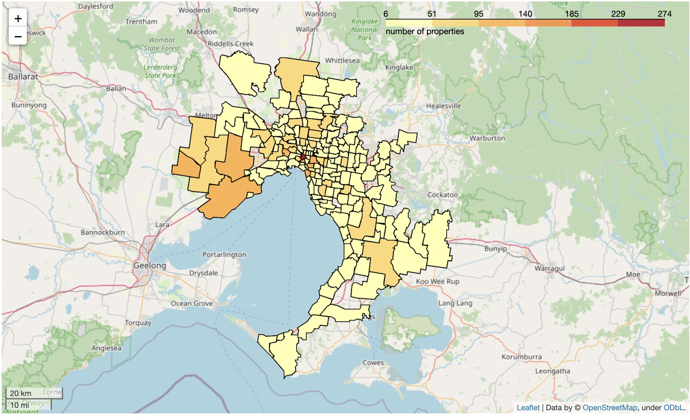
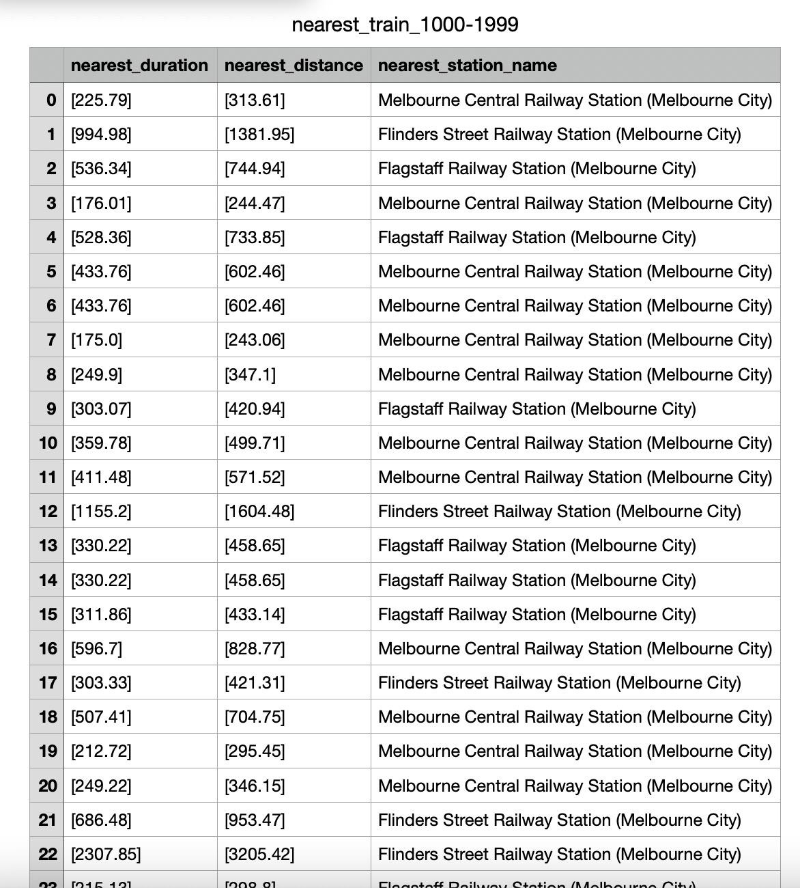
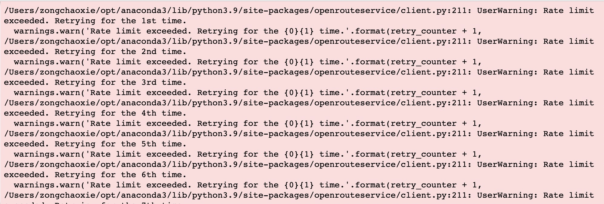

# Group 7 - Sprint 4 (Week 9) Meeting Minutes

**Since we have a sprint 3 meeting during friday and sunday which cannot post into earily weekly meeting notes (weekly meeting notes due on friday), we will post 2 sprint 3 meetings in sprint 4 meeting notes**

## Table of Content
- [Group 7 - Sprint 4 (Week 9) Meeting Minutes](#group-7---sprint-4-week-9-meeting-minutes)
  - [Table of Content](#table-of-content)
  - [Meeting Time: 2:00pm - 3:30pm, 16/9/2022, Friday](#meeting-time-200pm---330pm-1692022-friday)
    - [Agenda:](#agenda)
  - [Meeting Time: 4:15pm - 6:15pm, 19/9/2022, Monday](#meeting-time-415pm---615pm-1992022-monday)
    - [Agenda:](#agenda-1)
      - [***Domain Dataset***](#domain-dataset)
      - [***External Dataset***](#external-dataset)
      - [***ors problem***](#ors-problem)
      - [***All external dataset with features***](#all-external-dataset-with-features)
      - [***Modelling (prediction and analysis)***](#modelling-prediction-and-analysis)
      - [***Additionally, prepare a summary notebook (3-5 minutes max) including current findings and any additional insights so far. This task should assist in helping groups formulate their answers to the 3 big questions.***](#additionally-prepare-a-summary-notebook-3-5-minutes-max-including-current-findings-and-any-additional-insights-so-far-this-task-should-assist-in-helping-groups-formulate-their-answers-to-the-3-big-questions)
   
## Meeting Time: 2:00pm - 3:30pm, 16/9/2022, Friday
**Members Attend:**

- [x] QUZIHAN WU
- [x] XINGYAO WANG
- [x] YINAN LI
- [x] ZIXUAN GUO
- [x] ZONGCHAO XIE

### Agenda:
1. Domain dataset Preprocessing
    - remove postcode not within metro melbourne

    - remove postcode with less than 10 property (Assumptions)

2. External dataset summary
   - Still processing all download coding stuff together and PR to main
   - will done before **Tuesday**
   - Checking todo:
      - [ ] Organize coding stuff
      - [ ] Think about download.py or seperately
      - [ ] Organize all coding stuff (coding correction, results, comments)
      - [ ] Finish external dataset readme file with visualization
      - [ ] Rewrite pull request and merge  external data to *main* branch
      - [ ] Let group members know and create new branch for preprocessing external dataset
      - [ ] Preprocessing

3. Already find solution to preprocess distance, but we still face the ors time-out problem

4. Features:
   - At current work place, all domain dataset internal attributes and external attributes which we find in external data are all of our features

5. Think about model

6. Have a todo list during mid-break

## Meeting Time: 4:15pm - 6:15pm, 19/9/2022, Monday
**Members Attend:**

- [x] QUZIHAN WU
- [x] XINGYAO WANG
- [x] YINAN LI
- [x] ZIXUAN GUO
- [x] ZONGCHAO XIE

### Agenda:
**This weeks agenda is including all working stuff(already done) and tghe todo list during mid-break**

#### ***Domain Dataset***
- [x] download
- [x] visualization
- [x] README.md
- [x] merge raw dataset to main
- [x] preprocessing
  - remove postcode not within metro melbourne
  - remove postcode with less than 10 property (assumptions)
  - sample 50%, remaining 6073

- [ ] still need to decrease size?
- [ ] once finished, merge curated dataset to main

#### ***External Dataset***
- [x] download
- [ ] summarize and step 1 preprocess
  - [x] download.property_and_elector()
  - [x] download.PTV()
  - [x] download.hospital()
  - [x] download.emergency_service()
  - [x] download.public_service()
  - [x] download.care_facility()
  - [ ] download.income()
    - [x] url_suburb_to_postcode
    - [ ] total_income (error)
    - [ ] income
  - [ ] download.growth_rate()
  - [ ] download.criminal()
  - [ ] download.school()
    - [x] already get the idea which can download all school and distance from domain website
    - [x] waiting for url
    - [ ] download all 
    - [ ] download rank dataset
    - [ ] merge with rank
    - [ ] feature = rank or distance
- [ ] visualization
- [ ] README.md
- [ ] merge raw dataset to main

#### ***ors problem***
- [x] proximity to the closest MELBOURNE CBD

- [ ] proximity to the closest train station

  - still face time-out problem, should we sample main data??????

#### ***All external dataset with features***

#### ***Modelling (prediction and analysis)***
- [ ] Begin forecasting the rental properties for the next 3 years by suburb or any other suitable granularity. 

    **Rather, we will focus our assessment on the assumptions and approaches you took to obtain that result**
- [ ] Present some analysis on what features are useful in making a certain suburb more expensive and sought after
- [ ] focusing on big 3 questions

#### ***Additionally, prepare a summary notebook (3-5 minutes max) including current findings and any additional insights so far. This task should assist in helping groups formulate their answers to the 3 big questions.***
