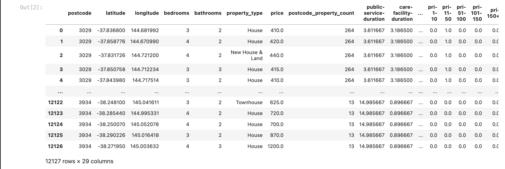

# Group 7 - Sprint 5 (mid-semester-break) Meeting Minutes

**Since we have a sprint 4 meeting during dunday which cannot post into earily weekly meeting notes, we will post 1 sprint 4 meetings in sprint 5 meeting notes**

## Table of Content
- [Group 7 - Sprint 5 (mid-semester-break) Meeting Minutes](#group-7---sprint-5-mid-semester-break-meeting-minutes)
  - [Table of Content](#table-of-content)
  - [Meeting Time: 2:00pm - 3:30pm, 25/9/2022, Sunday](#meeting-time-200pm---330pm-2592022-sunday)
    - [Agenda](#agenda)
    - [todo](#todo)
  - [Meeting Time: 3:00pm - 5:00pm, 28/9/2022, Wednesday](#meeting-time-300pm---500pm-2892022-wednesday)
    - [Agenda](#agenda-1)
    - [todo](#todo-1)
   
## Meeting Time: 2:00pm - 3:30pm, 25/9/2022, Sunday
**Members Attend:**

- [x] QUZIHAN WU
- [x] XINGYAO WANG
- [x] YINAN LI
- [x] ZIXUAN GUO
- [x] ZONGCHAO XIE

### Agenda
  - Domain dataset preprocessing already done, we decided to remove postcode not within metro melbourne and remove postcode with less than 10 property. 
    - remaining arount 12000 instance of data
  - duration data which processed by openrouteservice api are already download
    - contains train station data / care facility data / CBD data / emergency service data / hospital data / shopping center data
  - all external data are already doneload and save
    - contains: property and elector count / income / growth rate / criminal / school

### todo
- [ ] all external data need to preprocessing
- [ ] join all external features together
- [ ] all internal data need to selected and preprocessing
- [ ] join external features with internal features, save as model data
- [ ] focusing on model

## Meeting Time: 3:00pm - 5:00pm, 28/9/2022, Wednesday
**Members Attend:**

- [x] QUZIHAN WU
- [x] XINGYAO WANG
- [x] YINAN LI
- [x] ZIXUAN GUO
- [x] ZONGCHAO XIE

### Agenda
  - all external features and internal features already done preprocessing and merge part

### todo
  - model data need to preprocessing before modelling, we decide preprocess together, instead, modelling part will contains preprocessing
  - for modelling:
    - YINAN will fit some pyspark GBTClassifiers
    - XINGYAO will fit random forest
    - ZIXUAN will fit linear regression
    - ZONGCHAO will fit some naive bayes classifiers
    - QUZIHAN will cover all code processing, merge and will try do some assumption and fit lstm and arima
  - We will discussing modelling in saturday and see what we should imporve.

**We are planning to have group meeting during Saturday and Sunday, the meeting notes will be complete and show on Sprint 6 Meeting Checkpoint**
