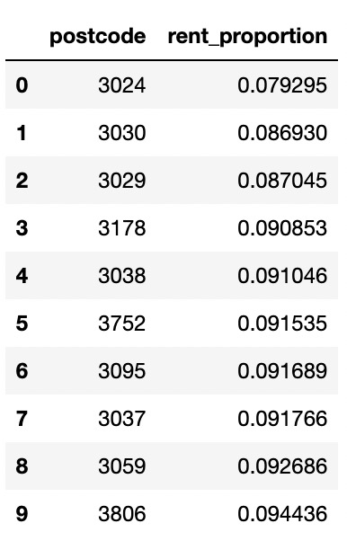

# Group 7 - Sprint 6 (Week-10) Meeting Minutes

**Since we have a sprint 5 meeting during sunday which cannot post into earily weekly meeting notes, we will post 1 sprint 5 meetings in sprint 6 meeting notes**

## Table of Content
- [Group 7 - Sprint 6 (Week-10) Meeting Minutes](#group-7---sprint-6-week-10-meeting-minutes)
  - [Table of Content](#table-of-content)
  - [Meeting Time: 2:00pm - 3:30pm, 2/10/2022, Sunday](#meeting-time-200pm---330pm-2102022-sunday)
    - [Agenda](#agenda)
      - [Scraping data](#scraping-data)
      - [Preprocessing data](#preprocessing-data)
      - [Modelling](#modelling)
          - [Linear Regression](#linear-regression)
          - [Random Forest](#random-forest)
        - [Naive Bayes](#naive-bayes)
        - [Pyspark - Gradient Boost Tree Regression](#pyspark---gradient-boost-tree-regression)
        - [Pyspark - XGBoost](#pyspark---xgboost)
        - [Liveable (ideas)](#liveable-ideas)
        - [Affordble (ideas)](#affordble-ideas)
        - [Predictions](#predictions)
  - [Meeting Time: 4:15pm - 6:15pm, 3/10/2022, Monday](#meeting-time-415pm---615pm-3102022-monday)
    - [Agenda](#agenda-1)
  - [Meeting Time: 4:00pm - 6:00, 4/10/2022, Tuesday](#meeting-time-400pm---600-4102022-tuesday)
    - [Agenda](#agenda-2)
  - [Meeting Time: 7:00pm - 9:00, 6/10/2022, Thursday](#meeting-time-700pm---900-6102022-thursday)
    - [Agenda](#agenda-3)
   
## Meeting Time: 2:00pm - 3:30pm, 2/10/2022, Sunday
**Members Attend:**

- [x] QUZIHAN WU
- [x] XINGYAO WANG
- [x] YINAN LI
- [x] ZIXUAN GUO
- [x] ZONGCHAO XIE

### Agenda
**mainly accoridng to summary notebook**
#### Scraping data
  - Finish scrape [domain dataset]('https://www.domain.com.au/') as our internal data
  - Finish download all external data

#### Preprocessing data
  - Finish preprocessing internal dataset
    - remove postcode not within metro melbourne 
    - remove postcode with less than 10 property
    - remaining 12127 properties with 180 suburbs

  - Finish preprocessing external dataset
    - the duration to closest
      - public service
      - care facility
      - shopping center
      - train station
      - hospital
      - CBD
      - emergency services
    - property and Elctor count
    - crime rate
    - income
    - school information calculated by ranking

  - Merge internal and external features together

#### Modelling 
**aims to provide students with an opportunity to help predict rental prices for both residential properties and apartments throughout Victoria, Australia**

1. What are the most important internal and external features in predicting rental prices?
2. What are the most liveable and affordable suburbs according to your chosen metrics?
3. What are the top 10 suburbs with the highest predicted growth rate?
4. Forecasting the rental properties for the next 3 years

###### Linear Regression
  - We would like to try the linear regression with categorical version of model data, but the ordinal data can not satisfy the assumption of linear regression. If we use one-hot encoding, the number of feature may increase to at least 60. So we decide not to use linear regression for feature selection.

###### Random Forest
  - assumption: the data feature is continuous and predicted label is also continuous
  - we see that there are some discrete values in model data, that is, categorical features. In order to meet the assumption, we turn them into continuous values through data preprocessing. In addition, the nominal data type of property type is converted into one-hot encoding through preprocessing, so now the input data meets the assumption. At this point, we can fit the data with RF
  - we used Grid Search to find the best parameter of 700, and then we found that the other Max features we used, whether SQRT or log, they all worked about the same
  - Random Forest does not have strong assumptions compared to linear regression, LR requires a trend of the dependent variable between its independent variable and the dependent variable, while RF does not
  - Because the housing market itself is very unstable, that is, there will be many outlier, RF is an emveding model, so its robust ability is very strong, so it will be less affected by the outlier of the housing price.

**From the summary of the model, we can see that the factors that have a greater impact on the house price are the number of bedrooms and geographical location, followed by the number of bathrooms**

##### Naive Bayes
   - We tried **GaussianNB** and **CategoricalNB**, since NB can only do classfication, the so we convert price to categorical with super cheap \ cheap \ expansive \ super expensive
   - Both use stratified k fold
   - Problems:
     - By checking pearson correlation, some features are dependent on each other
     - By checking permutation feature imoportance, find that some features are not important at all
     - model has high variance

##### Pyspark - Gradient Boost Tree Regression

##### Pyspark - XGBoost
   - RMSE and R2 score

   - Top 15 importance features based on F score

   - Top 15 importance features based on gain

##### Liveable (ideas)
   - According to https://auo.org.au/portal/metadata/urban-liveability-index/, the Liveability Index is a composite score based on measures related to aspects of liveability including Social Infrastructure, Walkability, Public Transport, Public Open Space, Housing Affordability, and Local Employment.
   - We would like to choose 5 metrics:
     - Social Infrastructure: Number of Social Infrastructure(public services, emergency services, hospital) in this postcode
     - (pending) Walkability: The duration between property and Social Infrastructure
     - Public Transport: The duration between property and train station
     - Housing Affordability: Rent proportion of income of each person
     - Local Employment: Median income of each postcode
   -  Assume equal importance. 
   -  Method 1: These five metrics are graded according to ranking, with a maximum of 20 points for each metric and a maximum of 100 points in total. For example, if we sort the duration, the most recent top 10% get 20 points, 10%-20% get 18 points, 20%-30% get 16 points...the last 20% get no points. Then after the score of each property comes out, follow the postcode group by to get the ranking of each suburb.
   -  Method 2: see what postcodes rank top 30 in all five metrics
   -  Method 3: fit models. Logistic maybe.

##### Affordble (ideas)
   - According to https://www.canstar.com.au/budgeting/affording-rent-payments/, it recommends that people should not spend more than 30% of gross income on rent
   - Therefore we would like to use weekly_rent/weekly_income to determine whether this subrub is affordable Since different property may have different number of bedroom, we assumed that the number of bedroom is number of people live in this house and we assumed that they will split the rent bill
   - So we use the total_price_of_property/number_of_bedroom to get the cost of rent od each people in each property, then we use this to divide median weekly income of the postcode that property located to get the rent_proportion

##### Predictions
   - we wanna apply timeseries model to forecasting the rental properties for the next 3 years, but the data we only get is 2022
   - we search from the website https://www.dhhs.vic.gov.au/past-rental-reports, we can get the past years quarterly rent data

   - still modelling ARIMA and LSTM
   - Is there any other method that we can use to prediction price???

## Meeting Time: 4:15pm - 6:15pm, 3/10/2022, Monday
**Members Attend:**

- [x] QUZIHAN WU
- [x] XINGYAO WANG
- [x] YINAN LI
- [x] ZIXUAN GUO
- [x] ZONGCHAO XIE

### Agenda
  - Scraping part finished
  - Preprocessing part finished
  - Modelling part
    - Question 1: Using Xgboost to train and conclude importance of features
    - Question 2: [fit time series regression model](https://ishan-mehta17.medium.comsimple-linear-regression-fit-and-prediction-on-time-series-data-with-visualization-in-python-41a77baf104c)
    - Question 3: 
      - Using Method 1: these five metrics are graded according to ranking, with a maximum of 20 points for each metric and a maximum of 100 points in total. For example, if we sort the duration, the most recent top 10% get 20 points, 10%-20% get 18 points, 20%-30% get 16 points...the last 20% get no points. Then after the score of each property comes out, follow the postcode group by to get the ranking of each suburb

## Meeting Time: 4:00pm - 6:00, 4/10/2022, Tuesday
**Members Attend:**

- [x] QUZIHAN WU
- [x] XINGYAO WANG
- [x] YINAN LI
- [x] ZIXUAN GUO
- [x] ZONGCHAO XIE

### Agenda
**This meeting mainly focus on presentation, we will have a outline of our presentation. Coding parts will start to summarize, comments and README file will done before Friday**

  - Presenataion Outlier
    - Working Timeline & Communication Tools (WU)
    - Project  Problem Overview (WU)
    - Feature Selection and Preprocessing (XIE)
    - Question 1: Importance of Features in determining rental price (WANG)
    - Question 2: Top 10 Suburbs (Postcode) with highest predicted Future Growth Rate based on predicted future rental price (GUO)
    - Question 3: Top 10 Liveable and Affordable Suburbs (Postcodes) (LI)
    - Proof-of-Concepts and References (WU and XIE)
      - How can this project be turned into money within the business context and/or clients and stakeholders? Ensure these recommendations are feasible and realistic
      - Is the project worth pursuing given the amount of work taken? How long do you think it would take to deliver an actual product? If so, does your groups’ current progression and approach support this
      - How did the group adhere to security/privacy requirements (i.e API keys, ensuring alldata is kept within the repository)?
      - What were the overall Limitations, Assumptions, Difficulties

## Meeting Time: 7:00pm - 9:00, 6/10/2022, Thursday
**Members Attend:**

- [x] QUZIHAN WU
- [x] XINGYAO WANG
- [x] YINAN LI
- [x] ZIXUAN GUO
- [x] ZONGCHAO XIE

### Agenda
**Presentation PPT done, this meeting maily for practice**

**We plan to have a meeting for practice presentation during FIRDAY, SATRUDAY and SUNDAY**